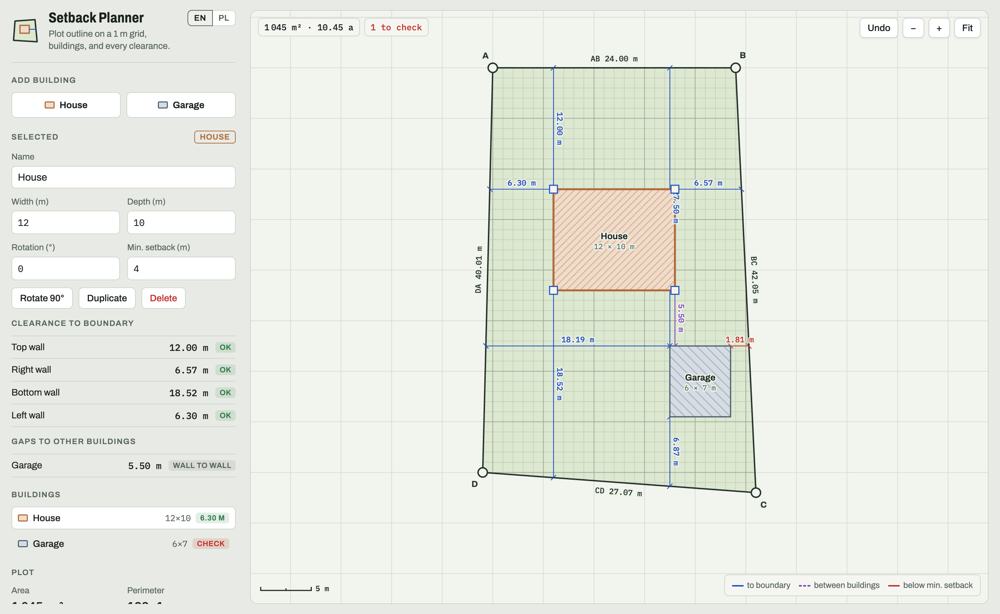
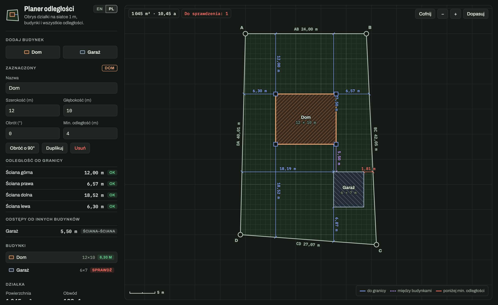
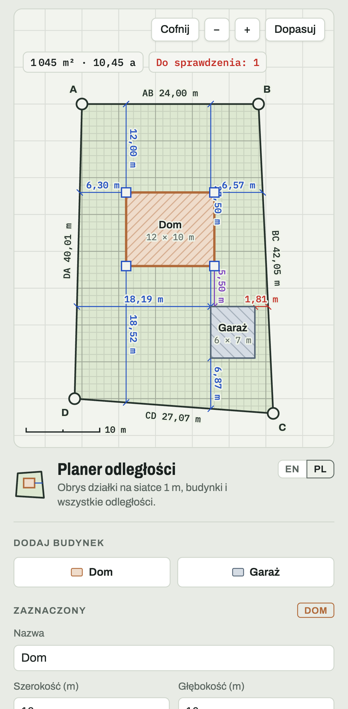

# Setback Planner

**Live: https://setback-planner.paperplane.builders**

Draw a four-corner plot on a 1 m grid, place houses and garages, and see every clearance to the boundary and between buildings. Walls closer than their minimum setback are flagged. Defaults follow Polish WT §12: 4 m for a wall with windows or doors facing the boundary, 3 m for a blank wall.

- English and Polish UI. It follows the browser language (Polish for `pl`, English otherwise), and the EN/PL toggle overrides it.
- The plan autosaves in the browser and in the page address, so the link is a shareable copy of the plan.
- Undo, snapping, JSON export/import, and pan/zoom/pinch on touch screens.



<table>
  <tr>
    <td width="68%"></td>
    <td></td>
  </tr>
</table>

## Development

The whole app is one static file, `public/index.html`, with no build step. Open it in a browser or serve the folder:

```bash
python3 -m http.server -d public 8765
```

## Deploy

The site is served as static assets by the `setback-planner` Cloudflare Worker on the custom domain set in `wrangler.jsonc`:

```bash
npx wrangler deploy
```
